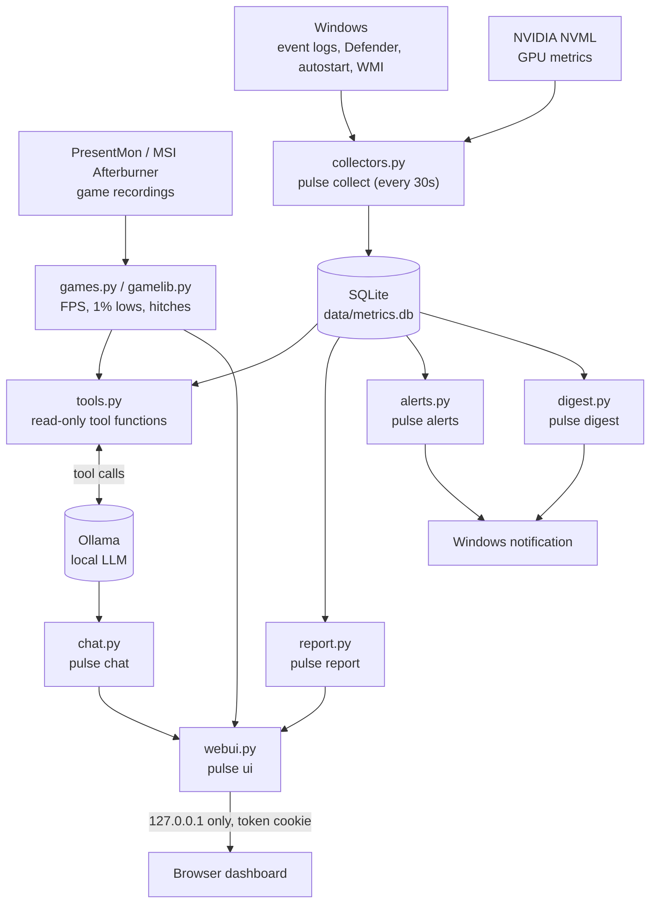

# Architecture

Pulse is a set of local, read-only tools around one SQLite database. Nothing leaves the machine:
the only network calls are to Ollama on `127.0.0.1` and to Windows itself (event logs, Defender,
Task Scheduler, WMI, NVML). See [Scope and safety](README.md#scope-and-safety-of-the-assistant)
for the read-only guarantee.

## Data flow

Everything downstream of `data/metrics.db` reads the same rows, so the chat, the report and the
dashboard never disagree with each other. `pulse collect` is the only writer.

## Modules (`src/pulse/`)

| File | Responsibility |
|---|---|
| `collectors.py` | Samples CPU/RAM/disk/network/GPU and the heaviest processes; writes `data/metrics.db` |
| `db.py` | SQLite schema, connection, pruning |
| `tools.py` | The read-only functions the LLM calls; docstrings double as tool descriptions |
| `chat.py` | The Ollama tool-calling loop (`pulse chat`) |
| `chatstore.py` | Saved conversations (`chats.json`), so the UI can reopen an earlier chat |
| `report.py` | Self-contained HTML report (`pulse report`) |
| `alerts.py` | Threshold checks -> Windows notification (`pulse alerts`) |
| `digest.py` | One daily "quiet / not quiet" notification (`pulse digest`) |
| `anomaly.py` | Statistical outlier detection used inside `metrics_history` |
| `procwatch.py` | Behavioral process check: new name, high CPU, growing memory |
| `binaries.py` | File location + Authenticode signature checks for a process |
| `netwatch.py` | Which process talked to which public address / port |
| `netstats.py` | On-demand per-process traffic measurement (`pulse netstats`, needs admin) |
| `winhealth.py` | Crashes, driver/disk errors, Defender status from Windows event logs |
| `persistence.py` | Autostart snapshot and diff (Run keys, tasks, services, WMI, browser extensions) |
| `ack.py` | Accepted-risk bookkeeping (`pulse ack`) |
| `timeline.py` | Assembles `what_happened` for one moment from every other source |
| `explain.py` | Plain-language explanations used by "what could this be?" in the UI |
| `games.py` / `gamelib.py` | PresentMon/Afterburner parsing and the user's game list |
| `scan.py` | Read-only folder-size scan (`pulse scan`, `largest_folders` tool) |
| `webui.py` / `webui_page.py` | The `pulse ui` server and its single-page dashboard |
| `setup_tasks.py` | Registers/inspects the three background Task Scheduler jobs |
| `settings.py` | User choices for the background jobs (`data/settings.json`) |
| `cli.py` | Argument parsing, dispatches to everything above |

## Background jobs

Three independent Task Scheduler jobs (`scripts/autostart.ps1`), each just re-running a CLI command
on a timer: `collect` (every 30 s), `alerts` (every 15 min), `digest` (once a day). No admin rights,
no service, a watchdog trigger restarts a dead one every 5 minutes.

## `pulse ui`

A single-process HTTP server bound to `127.0.0.1`. Every request needs a per-run secret token
(`?t=...`, then an HttpOnly `SameSite=Strict` cookie); Host/Origin are checked; the page is built
with `textContent` only (no innerHTML) under a strict Content-Security-Policy. It calls the same
`tools.py` / `report.py` functions as the CLI, so the numbers always match. Stops itself a few
minutes after the browser tab closes.

## Adding a tool

A new LLM-facing capability is usually three edits: a function in `tools.py` (read-only, plain dict
return, the docstring is the model-facing description), an entry in `chat.py`'s `SYSTEM_PROMPT`
describing when to call it, and a case in `tests/eval_tools.py` (see
[CONTRIBUTING.md](CONTRIBUTING.md)).
